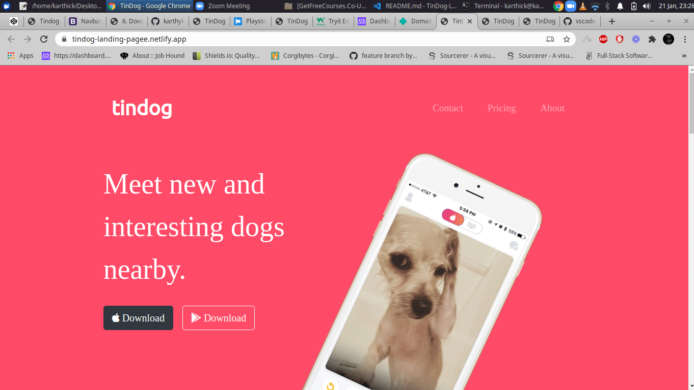

<div align="center" id="top"> 
  

  &#xa0;

  <a href="https://https://tindog-landing-pagee.netlify.app/">Demo</a>
</div>

<h1 align="center">TinDog Landing_page</h1>

<p align="center">
  

  

  

  

  <!--  -->

  <!--  -->

  <!--  -->
</p>

<!-- Status -->

<!-- <h4 align="center"> 
	🚧  TinDog Landing_page 🚀 Under construction...  🚧
</h4> 

<hr> -->


<br>

## About ##

It is a Landing Page for a startups

## :rocket: Technologies ##

The following tools were used in this project:

- [Html](https://expo.io/)
- [Css](https://nodejs.org/en/)
- [Bootstrap](https://pt-br.reactjs.org/)

## :checkered_flag: Starting ##

```bash
# Clone this project
$ git clone https://github.com/{{karthykarthick}}/tindog-landing_page

# Access
$ cd tindog-landing_page

```

## :memo: License ##

This project is under license from MIT. For more details, see the [LICENSE](LICENSE.md) file.


Made with :heart: by <a href="https://github.com/{{karthykarthick}}" target="_blank">{{Karthick}}</a>

&#xa0;

<a href="#top">Back to top</a>
